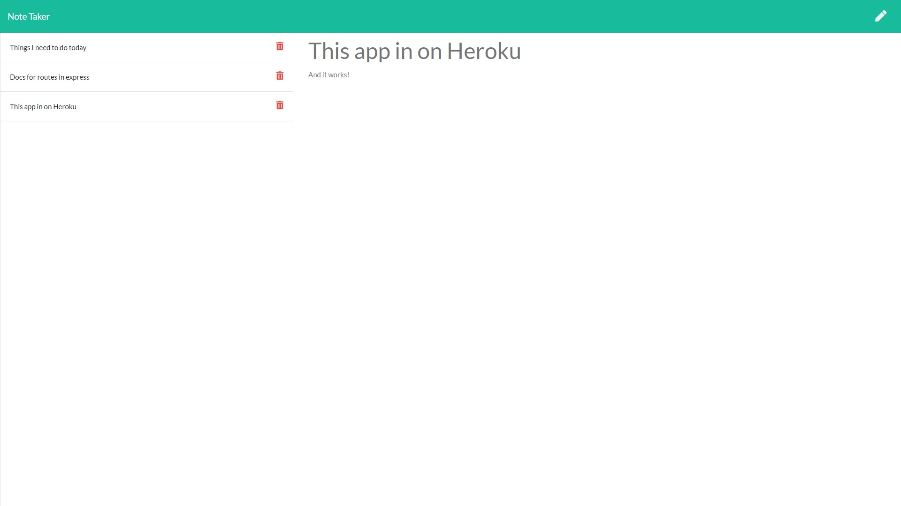

# Notetaker App

Allows the user to input, read, and delete notes.

## Table of Contents
* [Notetaker](#notetaker)
* [Deployment](#deployment)
* [Scope of Project](#scope-of-project)
* [Installation](#installation)
* [Credits](#credits)
* [License](#license)

## Notetaker

### Screenshot

## Deployment

Site deployed at [Note Taker](https://cdfishe1-notetaker.herokuapp.com/)

## Scope of Project

* Uses express.js to create a webserver that runs locally or via Heroku.
* Utilizes get, post, and delete methods to handle note display, creation, and deletion.

## Installation

* npm install to download the express dependency in node.
* Deploy files to webserver such as Heroku for live app usage.

## Credits

David Metcalf, bootcamp tutor, helped me understand how to think about the file system in express to deploy project properly.
Natalie Finnegan, bootcamp student, helped me pseudocode the post and delete methods.

## License

Copyright (c) Charles Fisher All rights reserved. 
Please be kind and change content if you wish to use this code.

Licensed under the MIT License

Copyright (c) 2021 - present | Charles Fisher

<blockquote>
Permission is hereby granted, free of charge, to any person obtaining a copy
of this software and associated documentation files (the "Software"), to deal
in the Software without restriction, including without limitation the rights
to use, copy, modify, merge, publish, distribute, sublicense, and/or sell
copies of the Software, and to permit persons to whom the Software is
furnished to do so, subject to the following conditions:

The above copyright notice and this permission notice shall be included in all
copies or substantial portions of the Software.

THE SOFTWARE IS PROVIDED "AS IS", WITHOUT WARRANTY OF ANY KIND, EXPRESS OR
IMPLIED, INCLUDING BUT NOT LIMITED TO THE WARRANTIES OF MERCHANTABILITY,
FITNESS FOR A PARTICULAR PURPOSE AND NONINFRINGEMENT. IN NO EVENT SHALL THE
AUTHORS OR COPYRIGHT HOLDERS BE LIABLE FOR ANY CLAIM, DAMAGES OR OTHER
LIABILITY, WHETHER IN AN ACTION OF CONTRACT, TORT OR OTHERWISE, ARISING FROM,
OUT OF OR IN CONNECTION WITH THE SOFTWARE OR THE USE OR OTHER DEALINGS IN THE
SOFTWARE.
</blockquote>

